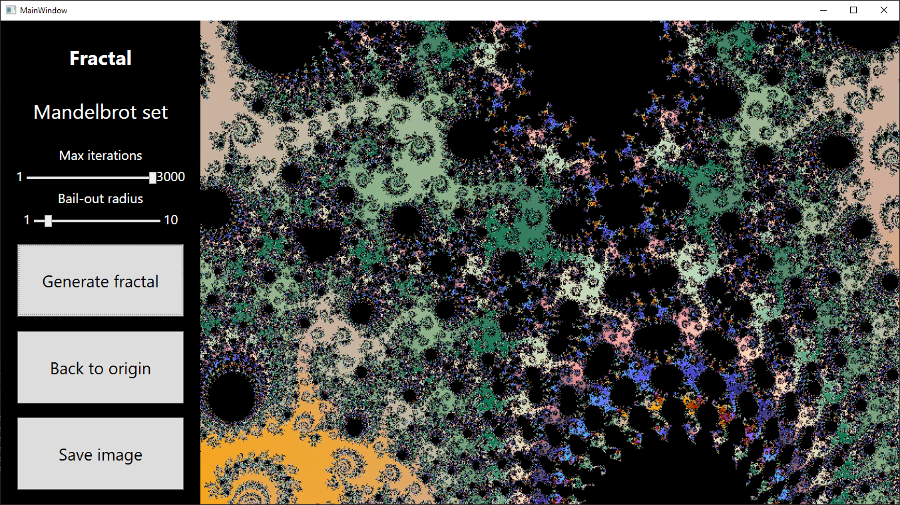

# Fractal viewer

You can move, zoom with mouse wheel, generate and save image that is currently displaying.

Mandelbrot set `Z^2 + C` is generated by default. You can change formula in the code.

You also can change image quality and colors in the code.

